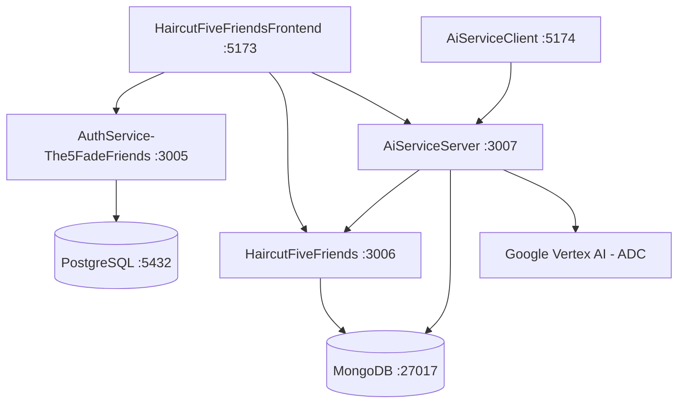

# AGENT-CONTEXT: HaircutFiveFriends Ecosystem

This is the definitive, up-to-date entry-point context file for AI Agents operating on the **HaircutFiveFriends** workspace. It provides high-signal mapping of services, databases, entry-points, ports, and protocols.

---

## 1. Architectural Map & Ecosystem Ports

| Service Directory | Port | Primary Responsibility | Primary Tech Stack | Database / Backend Connectors |
| :--- | :---: | :--- | :--- | :--- |
| **`AuthService-The5FadeFriends`** | `3005` | Auth & User Account Roles | Node.js (Express) | PostgreSQL (`HaircutFiveFriends` DB via Sequelize) |
| **`HaircutFiveFriends`** | `3006` | Main Business Logic & Models | Node.js (Express) | MongoDB (`HaircutFiveFriends` DB via Mongoose) |
| **`AiServiceServer`** | `3007` | AI Processing & Live WS Proxy | Node.js (Express) | MongoDB (`TodoGemini` / `GeminiDB` via Mongoose) & Vertex AI |
| **`HaircutFiveFriendsFrontend`** | `5173` | Core Client Portal | React 19 + Vite | Connected to Ports `3005`, `3006` and `3007` (AR try-on `/client/probar-corte`) |
| **`AiServiceClient`** | `5174` | Dedicated AI Voice & Chat client | React 19 + Vite | Connected to Port `3007` (HTTP + WS) |

---

## 2. Shared Infrastructure & Databases

1. **PostgreSQL Database (`AuthService`):**
   - Managed via Docker Compose inside `AuthService-The5FadeFriends/docker-compose.yml`.
   - ORM: Sequelize with `snake_case` fields and frozen table names.
   - Entities: `User` (registered users/barbers/admins), `Role` (admin, barber, client), `SignupRequest` (pre-registration validation).
2. **MongoDB Databases (`HaircutFiveFriends` & `AiServiceServer`):**
   - Main Business API DB: `HaircutFiveFriends` (collections for clients, barbers, appointments, haircuts, products, sales, details, invoices, reviews).
   - AI API DB: `TodoGemini` (collections for storing chat histories and session context).

---

## 3. Vertex AI & Google GenAI SDK Details

* **Current SDK:** `@google/genai` (v1.50.1) in `AiServiceServer`.
* **Authentication Method:** Application Default Credentials (ADC) with Google Cloud credentials (`gcloud auth application-default login`). No hardcoded API keys allowed.
* **Client Pattern:** Per-region lazy singletons in `AiServiceServer/configs/genai.js`. `getGenAI(location?)` caches one `GoogleGenAI({ vertexai, project, location })` per region in a `Map` (no arg → `GCP_LOCATION` = `us-central1`). `location` is fixed at client construction, so multiple regions = multiple clients.
* **Region Mapping:** TEXT (Gemini 3.x) runs only on the **`global`** endpoint (`LOCATIONS.TEXT`, override `VERTEX_TEXT_LOCATION`); Vision / Image / Live / Reviews stay on `us-central1`.
* **Models Mapping:**
  - **Text / Chatbot:** set via `VERTEX_TEXT_MODEL` (user uses a **GA** model, NOT `gemini-3.1-flash-lite-preview` — preview needs project allowlist)
  - **Facial Analysis (Vision):** `gemini-3.5-flash`
  - **Image Generation:** `gemini-3-pro-image-preview`
  - **Real-time Live Audio:** `gemini-live-2.5-flash-native-audio`

---

## 4. Minimum Context Protocol

To maintain maximum context efficiency, agents must strictly follow these rules:

1. **Mandatory Initial Handshake:** Always read `.obisidian-notes/AGENT-CONTEXT.md` first.
2. **Read Logs Next:** Read `.obisidian-notes/logs/` (newest notes) to see the state of active files and recently completed refactorings.
3. **No Speculative Reads:** Do NOT read any source files or implementation details outside of the active service assigned by the user for the current session.
4. **Session Wrap-Up:** 
   - Update `AGENT-CONTEXT.md` if any structural changes (routes, ports, schemas, dependencies) were introduced.
   - Document changes in `.obisidian-notes/logs/YYYY-MM-DD.md` focusing strictly on what was changed and why.

---

## 5. Global Health Verification Endpoints

* **Auth Service:** `GET http://localhost:3005/api/v1/health`
* **Business Service:** `GET http://localhost:3006/HaircutFiveFriends/api/v1/Health`
* **AI Service:** `GET http://localhost:3007/api/health`
